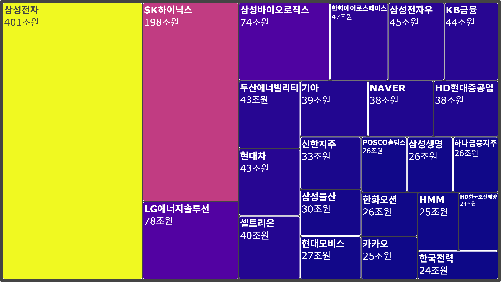

# 📊 국내 시가총액 및 ETF 데이터 분석 프로젝트

## 🧾 개요
**Playwright**를 활용해 Naver 금융에서  
- 국내 **코스피 시가총액**
- **ETF(상장지수펀드)**
  
데이터를 크롤링하고, 전처리 및 시각화를 통해 인사이트를 도출하는 데이터 분석 프로젝트


---

## ✅ 목적
- 웹사이트에서 **시가총액 데이터**를 자동으로 수집
- 자동으로 여러 페이지를 **순회하며 데이터 추출**
- 수집된 데이터를 바탕으로 **시각적 인사이트 제공**


---

## 💡 배경 지식

### 💰 시가총액(Market Cap)
- 기업의 시장 가치 = `주가 × 발행 주식 수`
- 기업 규모 및 시장 내 위치를 나타냄

### 📈 ETF (Exchange Traded Fund)
- 주가지수에 따라 수익률이 결정되는 상장 펀드
- 개별 종목이 아닌 지수에 투자


---

## 🗂️ 프로젝트 구성

```
stock/
├── crawl_marketcap.py # 코스피 데이터 수집
├── crawl_etf.py # ETF 데이터 수집
├── preprocess.py # 전처리 함수 모듈
├── visualize_marketcap.py # 시가총액 시각화
├── visualize_etf.py # ETF 시각화
├── output/
│ ├── result.csv    # 코스피 데이터 최종
│ ├── result_etf.csv    # ETF 데이터 최종
│ ├── result_tree.png    # 시가총액 상위 50% tree map
│ ├── ETF_returns_20.png    # ETF 3개월 수익률 상위 TOP 20
│ ├── viualize_marketcap.csv    # 시가총액 tree map에 사용
│ ├──
│ ├── 
│ └── 
└── README.md
```

---

## 🧰 사용 기술

- Python
- [Playwright](https://playwright.dev/python/) – 웹 자동화
- Pandas / NumPy – 데이터 처리
- Plotly – 시각화
- Scikit-learn – 클러스터링 기반 분석


---

## 📥 데이터 수집

### 📌 코스피 시가총액
- [네이버 금융 시가총액 페이지](https://finance.naver.com/sise/sise_market_sum.naver)
- 종목명, 시가총액, PER 등 포함

### 📌 ETF 정보
- ETF 리스트 페이지에서 3개월 수익률, NAV 등 수집
- `...`으로 생략된 이름은 상세 페이지에서 보완


---

## 🧼 데이터 전처리
- 공백 문자 정제 및 데이터 프레임 변환
- 쉼표, `%` 포함된 숫자 → `float`로 변환
- 누락/결측값(`'-'`, `'NaN'`) 제거
- 종목명 중복 시 처리
- 불필요한 열 제거 및 정규화


---

## 📈 데이터 시각화

### 📌 시가총액 상위 50% 종목 Treemap

1. **극심한 상위 집중 현상**
  - 삼성전자가 단독으로 401조 원으로 가장 큰 면적을 차지
  - 그 다음은 SK하이닉스 (198조), 이 둘만 합쳐도 시총 상위 50%의 거의 절반을 차지  
  → 상위 소수 기업(특히 반도체)에 코스피 전체 자산이 매우 집중


2. **산업별 비중 파악**
  - 상위권에 위치한 산업 섹터는 대부분:
  - 반도체/IT (삼성전자, SK하이닉스, 삼성바이오로직스)
  - 자동차/에너지/조선 (현대차, 현대모비스, 한국전력, HD현대중공업 등)
  - 금융 (KB금융, 삼성생명, 하나금융지주 등)


3. **Treemap 색상 대비로 인한 시가총액 규모 인식**
  - 색상으로 상대적 규모 파악 가능.
  - 삼성전자 = 노란색 → 가장 큼
  - 하위권 = 남색 → 상대적으로 적음  
  → 시각적 중요도와 경제적 비중이 직관적으로 매칭됨


  4. **상대적 소외주 확인 가능**
  - 50% 안에는 들었지만, 면적이 확 줄어드는 구간에서 상대적 중형주가 포함
  - 예: POSCO홀딩스, HMM, 한국전력 등 → 시총은 크지만 상위와 격차 있음

---

### 📌 ETF 3개월 수익률 TOP20

 1. **특정 테마 ETF의 강세**
  - TIGER 미국필라델피아반도체나스닥(환헷지), TIGER 200IT레버리지, SOL 미국초거대AI테마TOP10 등:
  - 상위권 대부분이 반도체, AI, IT 섹터 ETF임을 확인할 수 있음.
  - 특히 반도체 섹터는 미국 시장 상승과 맞물려 수익률이 110% 이상으로 매우 높음.  
  → 이는 최근 3개월 동안 테크/AI 주도 상승장이 ETF에 강하게 반영된 결과로 해석


2. **레버리지 ETF의 존재**
  - 상위권에 2배 수익을 추구하는 레버리지 ETF가 여럿 있음.
  - 예: TIGER 200IT레버리지, KODEX 레버리지, TIGER Fn수소에너지.
  - 변동성이 큰 만큼, 상승장에서는 빠르게 수익률을 끌어올림.
  - 하지만 하락장에서는 반대로 리스크가 크므로, 개인 투자자의 경우 주의가 필요함.


3. **국내보다는 미국 중심 ETF 강세**
  - 미국 기술주, 반도체 관련 ETF가 상위에 집중되어 있음.
  - 국내 테마 ETF보다 글로벌 혹은 미국 테마 ETF의 수익률이 전반적으로 우수.  
  → 이는 최근 미국 증시 상승세가 ETF 성과에 영향을 미쳤음을 시사


4. **전략적 인사이트**
  - 향후 ETF 포트폴리오 구성 시 다음과 같은 전략이 유효할 수 있음:
  - 상승 추세에 있는 글로벌 테마 ETF(AI, 반도체, 기술주)에 대한 비중 확대 고려.
  - 환율 리스크를 관리하고 싶다면 환헷지형 상품 선택 가능.
  - 고위험 고수익을 원한다면 레버리지 ETF를 포트 일부에 한정적으로 편입.

  #### 결론 
  이 차트는 단순한 수익률 비교를 넘어서  
  현재 시장의 **핵심 성장 동력(반도체, AI)** 이 어디에 있는지  
  **어떤 ETF 유형(글로벌/레버리지)이 반응**하는지  
  파악하는 데 매우 유용

---
